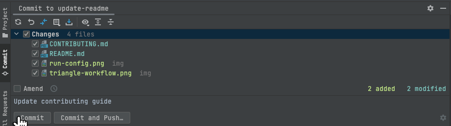

# Contributing to mqtt-cli

Welcome to the HiveMQ Community! Glad to see your interest in contributing to mqtt-cli.
For some general information on how the HiveMQ Community is organized and how contributions will be accepted please have a look at 
our [HiveMQ Community Repo](https://github.com/hivemq/hivemq-community). 

## Prerequisites

We recommend to develop your changes by using [IntelliJ IDEA](https://www.jetbrains.com/idea/). 
Therefore, the following guide will focus on creating your changes using IntelliJ. 

Furthermore, the following is needed to make your development efforts as smoothly as possible:
- A Java 8 JDK (for example [Azul Zulu JDK](https://www.azul.com/downloads/)) 
- [Docker](https://www.docker.com/) 
- Fill out and sign the [Contributor License Agreement](https://www.hivemq.com/downloads/Contributor_License_Agreement.pdf)
  - Send the signed agreement  to (contributing@hivemq.com) with the subject `CLA for Project: <Project Name>`.
  - Please read this document carefully before signing it and keep a copy for your own records
  - Once we've received your signed CLA, you will be added to the list of contributors and our HiveMQ Development Team will review your contributions
  - In case the rights to all intellectual property created by you are maintained by your employer, including your work on HiveMQ Open Source Projects, you must ensure you have retained all rights to grant the license, or that your employer has agreed to a separate [Corporate CLA](https://www.hivemq.com/downloads/Corporate_Contributor_License_Agreement.pdf)

## 1. Setup project

- The following steps will setup a triangle workflow, which will enable you to easily create, update and get your changes into the master branch 

- Fork the repository by clicking "Fork" on the main project page (A fork will be created under https://github.com/yourgithubname/mqtt-cli.git)

- Clone your fork via IntelliJ by going to <i>File > New > New Project from Version Control</i> OR by using the command `git clone https://github.com/yourgithubname/mqtt-cli.git`

- Complete the triangle workflow setup by adding `https://github.com/hivemq/mqtt-cli.git` as a remote named _upstream_ via IntelliJ by going to <i>Git > Manage Remotes > + </i> OR by using the command `git remote add upstream https://github.com/hivemq/mqtt-cli.git` 

 

## 2. Create a branch for your changes

- Decide on your branch name:
  - Branch types: feature, bugfix, improvement, cleanup (same as the label of a corresponding GitHub Issue)
  - Starting with type: `feature/`, `bugfix/`, `improvement/`, `cleanup/`
  - \+ task: lower case, spaces replaced with `-`
- Create your branch by using IntelliJ's branch functionality at the bottom of the IDE (<i>upstream/master > New Branch from 'upstream/master'</i>) OR by using the command `git checkout -b branch-type/your-branch-name`

## 3. Write your code

- Implement your changes under `src/main/java`
- You can use the existing code as a guide
- The project uses Nullability annotations to avoid NullPointerExceptions: `@NotNull`, `@Nullable`. 
  Every non-primitive parameter, return type and field should be annotated with one of them.

## 4. Write tests

- There are three types of tests in mqtt-cli:
  1. Unit Tests => `src/main/test`
  2. Integration Tests => `src/main/integrationTest`
  3. System Tests => `src/main/systemTest`
- Your code changes must be unit-tested
- Depending on your changes an integration test should be written
- Depending on your changes or if you are developing a new feature a system test should be written

## 5. Build and test

- See [Building from source](https://hivemq.github.io/mqtt-cli/docs/installation/#building-from-source) for instructions on how to build mqtt-cli
- Before proceeding to the next step, please make sure that your changes build and all tests succeed
- Tip: After building mqtt-cli you can execute the cli by using the generated jar file `java -jar build/libs/mqtt-cli-<version>.jar` (you can also just build this jar by using `./gradlew shadowJar`)
- Tip: To quickly test your changes manually you can directly execute commands from your IDE by going to <i>Run > Edit Configurations...</i> and adding your cli arguments

## 6. Commit and Push
- Before committing execute `./gradlew licenseFormat` to add license headers to each file
- [Reformat each changed file](https://www.jetbrains.com/help/idea/reformat-and-rearrange-code.html#reformat_file) using the .editorconfig settings of the project
- Commit your changes directly from IntelliJ by pressing `Command` + `K` OR via the command `git commit -m "your commit mesage"`
  - Commits should be as atomic as possible
  - Commit messages should describe the changes clearly
  - Commit messages should start with a capital letter for consistency
  - Commit messages should avoid exceeding the line length limit,
  - Instead use multiple lines, each describing one specific change

- Push your changes to the remote `origin` by pressing `Command` + `Shift` + `K` OR via the command `git push origin branch-type/branch-name`

## 7. Create a Pull Request

- By contributing your code, you agree to license your contribution under the terms of the
  [Apache License, Version 2.0](https://github.com/hivemq/hivemq-mqtt-client/blob/develop/LICENSE)
- Go to your GitHub fork under https://github.com/yourgithubname/mqtt-cli.git
- Go to the <i>Pull Requests</i> tab
- Press the <i>New Pull Request</i> button
- Choose your branch and click <i>Create Pull Request</i>

- We will now try to review your submitted code as fast as possible
- Furthermore, our CI will run tests against the changes
- To address requested changes during code review or if you need to address failing CI tests, simply push your changes to your remote as described above
- You may need to rebase your branch if you haven't worked on it for some time - To do so simply go to the <i>Git branch > upstream master > Rebase 'your-branch' onto 'upstream/master'</i> OR via the command `git rebase upstream/master` 

- As soon as the Code Reviewer has approved your Pull Request Merge your PR by clicking <i>Rebase and Merge</i>

## 🚀 Thank you for taking the time to contribute to mqtt-cli!  🚀

We truly appreciate and value your time and work. ❤️

