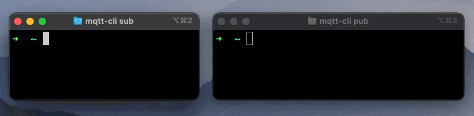
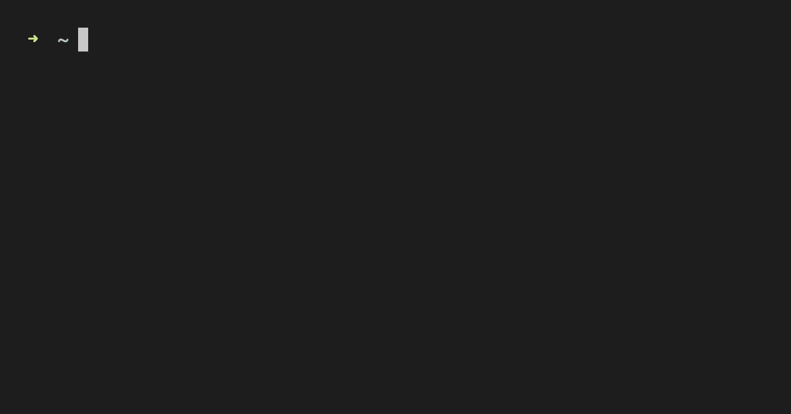

<i>mqtt-cli</i> is a <b>feature-rich MQTT Command Line Interface</b>.

  
[Getting Started](#getting-started) •
[Publish](#publish) •
[Subscribe](#subscribe) •
[Shell](#shell) •
[Test](#test) •
[How to Contribute](#how-to-contribute)

## Getting Started

- [Installation instructions](https://hivemq.github.io/mqtt-cli/docs/installation/) 
- [Building from source](https://hivemq.github.io/mqtt-cli/docs/installation/#building-from-source) 
- [Full documentation](https://hivemq.github.io/mqtt-cli)

## Publish

- Publish a message
- Quick start: `mqtt pub -t your-topic -m "your message" -h your-mqtt-broker.com`
- [Further documentation](https://hivemq.github.io/mqtt-cli/docs/publish/) 

## Subscribe

- Subscribe to topics and receive output directly on the console
- Quick start: `mqtt sub -t your-topic -h your-mqtt-broker.com`
- [Further documentation](https://hivemq.github.io/mqtt-cli/docs/subscribe/)

## Shell

- Enter the <i>mqtt-cli shell</i> mode to access more MQTT functionality
- Quick start: `mqtt sh`
- [Further documentation](https://hivemq.github.io/mqtt-cli/docs/shell/)

## Test

- Run tests against a broker to find out its features and limitations
- Quick start: `mqtt test -h your-mqtt-broker.com`
- [Further documentation](https://hivemq.github.io/mqtt-cli/docs/test/)

## How to Contribute
- If you want to request a feature or report a bug, please [create a GitHub Issue using one of the provided templates](https://github.com/hivemq/mqtt-cli/issues/new/choose)
- If you want to make a contribution to the project, please have a look at the [contribution guide](CONTRIBUTING.md)
